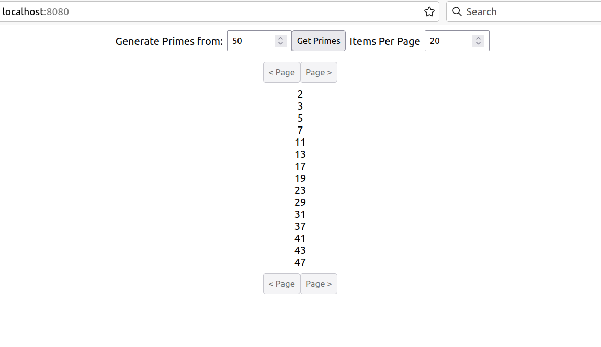

# Prime Number Generator

Prime Number Generator is a simple JSON REST API that returns a list of all prime numbers that are less than or equal to a given input parameter. The REST API has been implemented using Spring Boot using JDK-11. 

## Testing & Building

Make sure you have a JDK installed on the machine this is being run on. If you are interested in building a Docker image of this application please ensure you have Docker installed on the machine too. From the command line clone the Prime Number Generator project from gitHub.
```bash
git clone https://github.com/mnccouk/prime-gen.git
```

Then change to the prime-gen project directory and execute

```bash
./gradlew test
```

This command will run through a series of tests, If all goes well, you should see a 'BUILD SUCCESSFUL' message. Further details of the tests can be found by viewing - ./build/reports/tests/test/index.html inside the project directory.

Code coverage reports can be found at - /build/reports/jacoco/test/html/index.html

### Building

From the 'prime-gen' folder execute
```bash
./gradlew build
```
If the build is successful, this command will create a runnable jar file in the ./build/libs folder named something similar to prime-number-generator-1.0.jar.

### Running the Prime Generator API
After running a build, as noted above, navigate to the ./build/libs directory and execute
```bash
java -jar prime-number-generator-1.0.jar
```
Please note you will have to change the version number in the jar file name above to match what is generated by the build. 

A few messages should scroll up as the application starts. Once complete the final message should say something like - 'Started PrimeNumberGeneratorApplication', with this, the application can now be used.

A sample frontend application is also bundled with the project. In your web browser navigate to http://localhost:8080/ to load the application and drive the API fron this sample frontend.

### Running as a Docker container
From within the project root directory run
```bash
./gradlew dockerRun
```
The above command will compile, test and deploy frontend and backend into a Docker image. The image will also be used to create and start a Docker container. The Docker container is configured to run on port 8080 so ensure this port is free before executing the above command.

In your web browser navigate to http://localhost:8080/. The frontend should be displayed and application ready to use.



### The REST API 
The application supports OpenAPI Definition where documentation can be found for the REST API served out by this application. The documentation can be accessed using the following URL. - http://localhost:8080/swagger-ui/index.html. Please ensure the application has started before trying to access the above URL.

Below screenshot shows API documentation of the single REST call exposed by this application.


The API specification can be used by a client to auto generate client side code using OpenAPI client utilities. JSON specification can be referenced using - http://localhost:8080/api-docs


### Limitations
Prime numbers are generated in the range of 32 bit signed integer, this gives us a max value of 2147483647 for the fromNumber value, therefore no prime numbers larger than this value can be generated. 


