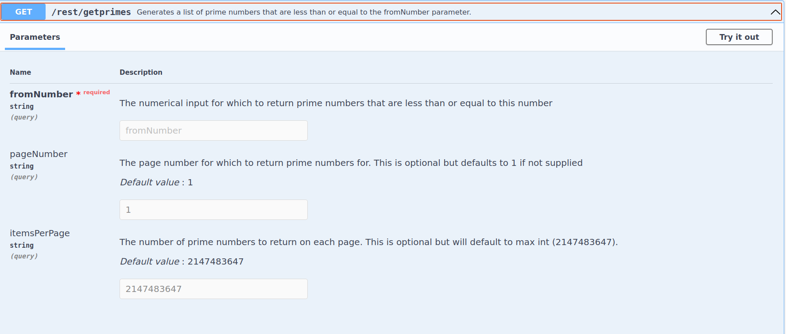

# Prime Number Generator

Prime Number Generator is a simple JSON REST API that returns a list of all prime numbers that are less than or equal to in input parameter. The REST API has been implemented using Spring Boot using JDK-11. 

## Testing & Building

Make sure you have a JDK installed on the machine this is being run on, then, from the command line clone the Prime Number Generator project from gitHub.
```bash
git clone https://github.com/mnccouk/prime-gen.git
```

Then change to the prime-gen directory and execute

```bash
./gradlew test
```

If all goes well, you should see a 'BUILD SUCCESSFUL' message. Further details of the tests can be found by viewing - 
./build/reports/tests/test/index.html

Code coverage reports can be found at - /build/reports/jacoco/test/html/index.html

### Building

From the 'prime-gen' folder execute
```bash
./gradlew build
```
If the build is successful, this command will create a runnable jar file in the ./build/libs folder named prime-number-generator-1.0.jar.

### Running the Prime Generator API
After running a build, as noted above, navigate to the ./build/libs directory and execute
```bash
java -jar prime-number-generator-1.0.jar
```
A few messages should scroll up as the application starts. Once complete the final message should say - 'Started PrimeNumberGeneratorApplication', with this, the application can now be used.


### The REST API 

This application supports OPEN API Definition where documentation can be found for the REST API served out by this application. The documentation can be accessed using the following URL. - http://localhost:8080/swagger-ui/index.html. Please ensure the application has started before trying to access the above URL.



This provides details on the API specification and also can be used by a client to generate Client side code using Open API client utilities. JSON specification can be referenced using - http://localhost:8080/api-docs


### Limitations
Prime numbers are generated in the range of 32 bit signed integer, this gives us a max value of 2147483647 for the fromNumber value.
If no page is specified and a large number is used for the 'fromNumber' parameter returning the results will take a long while.
Performance gain could be achieved by creating a more fine grained index file(idx.dat).  


 


